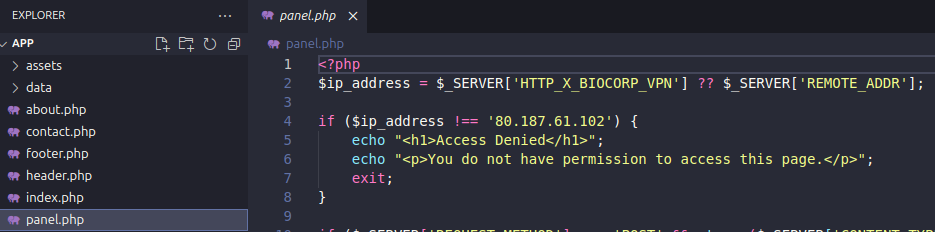
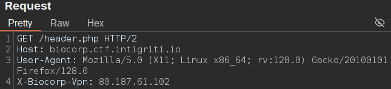
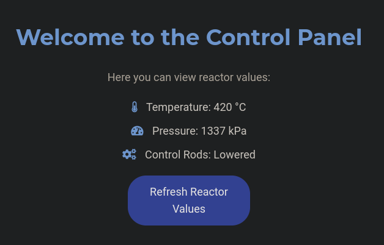
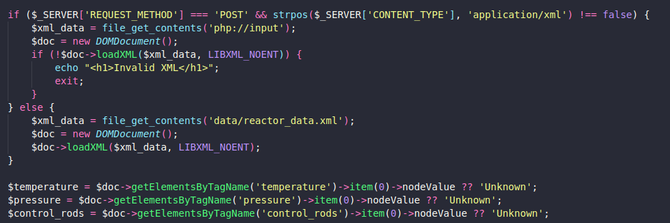
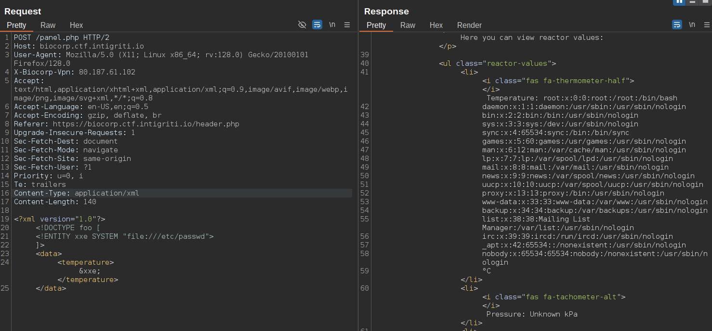
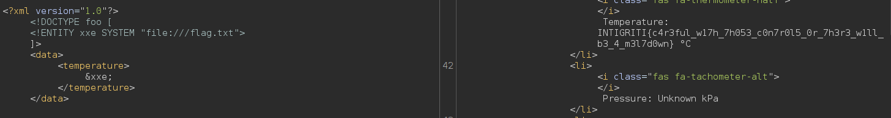

**Web - BioCorp**

Summary
During this challenge, a .zip file containing the website's source code was provided. Through analysis, we identified vulnerabilities that allowed access to sensitive functionalities and ultimately led to flag extraction.

Details
Initial Discovery
The source code revealed a panel.php file requiring a specific HTTP header for access:

Once authenticated, a "Control Panel" option becomes available, redirecting to the following page:

Source Code Analysis
Inspecting the page source highlighted additional elements, prompting further investigation:

XXE Exploitation
The identified patterns suggested a potential XML External Entity (XXE) vulnerability. Exploitation was attempted as follows:

Outcome
The attack successfully allowed access to the target resource, and the flag was retrieved:

