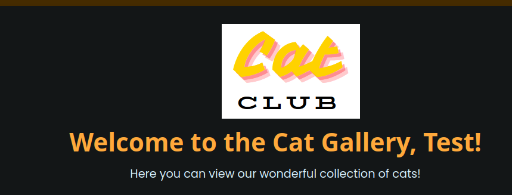
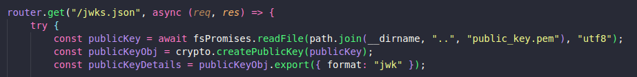
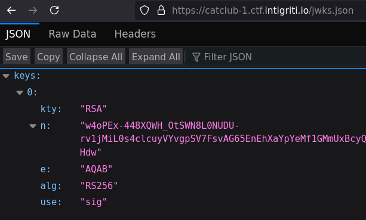
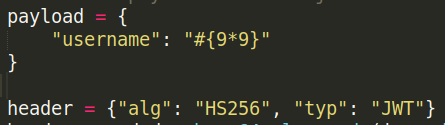
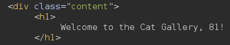
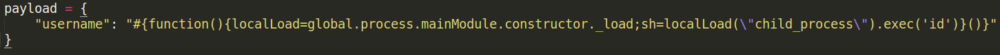
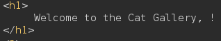
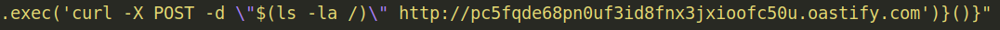
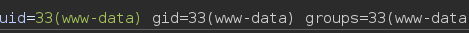
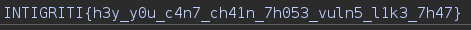

**Web - Cat Club**

Summary
This challenge provided a .zip file containing the website's source code. Analyzing the code revealed vulnerabilities that allowed server-side template injection (SSTI) exploitation and subsequent flag retrieval.

Details
Initial Discovery
The site offers a login feature and a gallery displaying cat images. The username is reflected on the gallery page, suggesting a potential SSTI vulnerability:

However, the registration process only accepts usernames containing alphanumeric characters. The site uses JSON Web Tokens (JWT), and with the source code, it was possible to forge a custom token.

Endpoint Analysis
An interesting endpoint was identified in the source code:

 

and

Using the information gathered, we forged a JWT with the HS256 algorithm, injecting the payload #{9*9} in the username field to test SSTI:

The test was successful:

Exploitation
The source code revealed the use of PugJS as the templating engine. Using a payload from HackTricks, we attempted further exploitation. However, there was no visible response on the web page.

To confirm execution on the server side, we tested the id command:

The returned field was empty:

We then used curl to confirm server-side execution by sending an external response:

The server successfully executed the command, and we retrieved the result:

Flag Retrieval
With confirmed code execution, retrieving the flag was straightforward:

