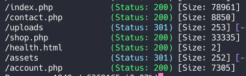
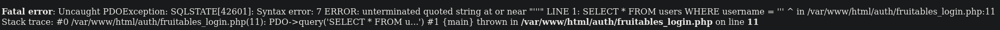
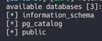
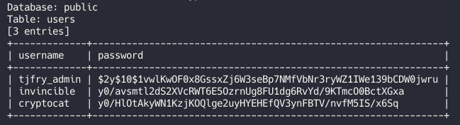
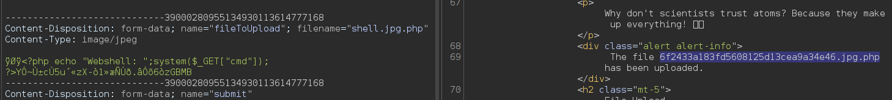
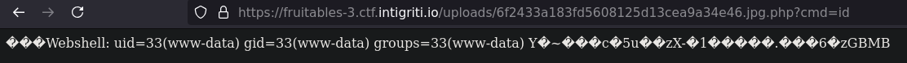
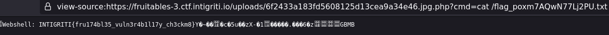

**Web - Fruitables**

Summary
This challenge did not provide source code, requiring manual reconnaissance and testing. By identifying key endpoints, exploiting an SQL injection (SQLi) vulnerability, and bypassing file upload restrictions, we achieved remote code execution (RCE) and retrieved the flag.

Details
Initial Reconnaissance
With no source code available, directory enumeration using gobuster identified interesting endpoints:

Two key findings emerged:

/upload: Likely used for file uploads.
/account.php: A login page, but registration was disabled, and no credentials were available.
SQL Injection
Testing the username field with a single quote (') revealed a potential SQL injection:

Manual exploitation attempts were unsuccessful, so we utilized sqlmap for automated exploitation:

By cracking the administrator's password, we gained access to the dashboard, which included a file upload feature.

 

File Upload Bypass
Initial attempts to upload a web shell were blocked:

Changed the file extension to .jpg.
Added a valid JPEG signature to the file header.
Adjusted the Content-Type to image/jpeg.
The modified file was successfully uploaded:

 

Remote Code Execution and Flag Retrieval
By accessing the uploaded web shell, we executed commands on the server and retrieved the flag:

