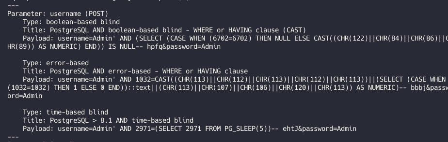

**Web - Fruitables**

Summary
This challenge didn’t include source code, so everything had to be done manually. We found key endpoints, exploited an SQL injection, bypassed file upload restrictions, got RCE, and retrieved the flag.

Initial Reconnaissance
Without source code, we used gobuster for directory enumeration and found useful endpoints:

Two important ones:

    /upload: Likely for file uploads.

    /account.php: A login page. Registration was disabled, and no credentials were available.
    
SQL Injection
Testing the username field with a single quote (') showed a possible SQL injection:

Manual exploitation didn’t work, so we used sqlmap to automate it:

We cracked the admin password and logged in. The dashboard had a file upload option:

 

File Upload Bypass
First attempts to upload a web shell were blocked:

To bypass the filter, we:

    Renamed the file with a .jpg extension

    Added a valid JPEG header

    Set Content-Type to image/jpeg

The file upload worked:

 

We accessed the uploaded shell, ran commands on the server, and got the flag:

