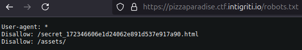
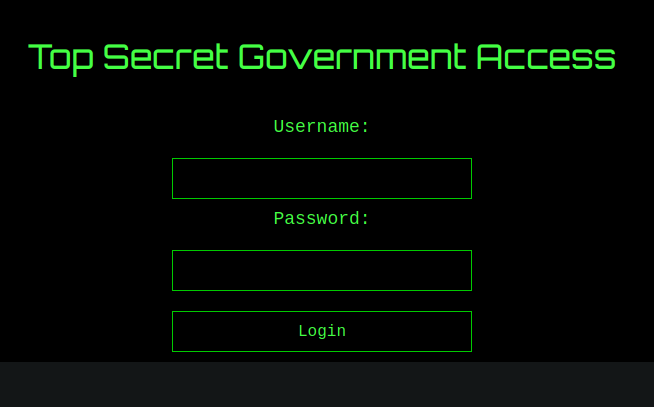
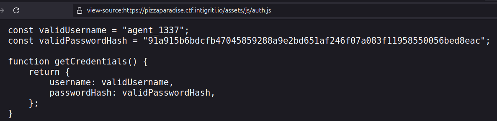
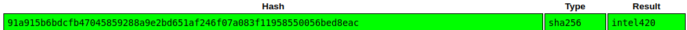
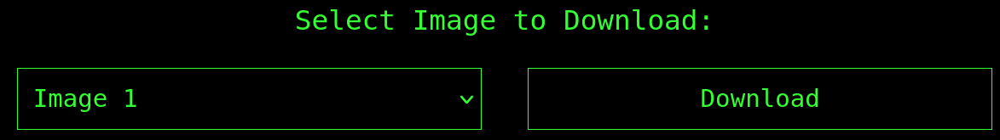
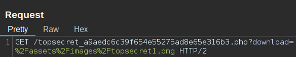
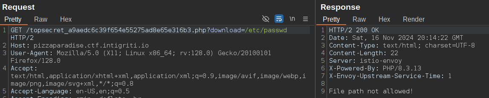
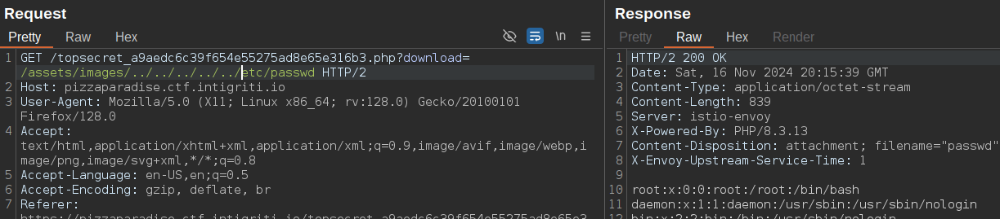
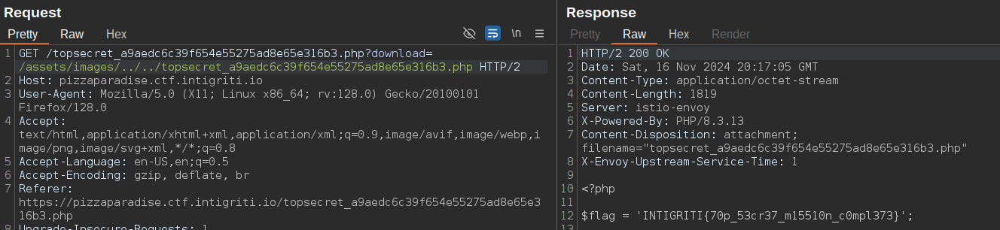

**Web - Pizza Paradise**

Summary
This challenge involved uncovering sensitive information via a misconfigured robots.txt, cracking a hashed password, and exploiting a Local File Inclusion (LFI) vulnerability to retrieve the flag.

Details
Initial Discovery
Checking the /robots.txt file revealed a hidden directory:

The hidden directory led to a login page:

Credential Retrieval
Examining the page source code revealed a file, auth.js, containing the username and a hashed password:

The hash was successfully cracked using Crackstation, revealing the plaintext password:

Using the recovered credentials, we logged in and gained access to a page with an image download feature:

Local File Inclusion (LFI) Exploitation
Intercepting the download request with a proxy revealed that the file path was vulnerable to LFI:

Initial attempts to read /etc/passwd were blocked:

Adjusting the file path to include the base directory /assets/images bypassed the restriction:

Flag Retrieval
Inspecting the source code of the current page revealed the flag:

