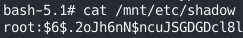

# Data

The challenge involves exploiting a vulnerable Grafana instance and escalating privileges to obtain root access.

## Reconnaissance

Initial port scanning with Nmap revealed two open ports:

```
PORT     STATE SERVICE VERSION
22/tcp   open  ssh     OpenSSH 7.6p1 Ubuntu 4ubuntu0.5 (Ubuntu Linux; protocol 2.0)
3000/tcp open  ppp?
```

Further investigation of port 3000 uncovered a web application running Grafana 8.0.0, which is vulnerable to CVE-2021-43798, an unauthorized arbitrary file reading vulnerability.

## Initial Access

The vulnerability was confirmed using Burp Suite: 


We then attempted to access the sensitive "grafana.db" file: 


Extracting data from the database yielded two password hashes:


To crack these hashes, we utilized a Python script (https://github.com/iamaldi/grafana2hashcat) to format them correctly for Hashcat:

```
hashcat -m 10900 hashcat_hashes.txt /opt/rockyou.txt
```

This successfully cracked the password for the user "boris". Using the cracked credentials, we established an SSH connection: 


## Privilege Escalation
Initial enumeration with sudo -l revealed:

```
(root) NOPASSWD: /snap/bin/docker exec *
```

This suggested the ability to execute any Docker container with root privileges. Further investigation of running processes revealed a container ID: 


We leveraged this information to gain root access to the container:

```
sudo /snap/bin/docker exec -it -u root <container_id> /bin/bash
```

Using df -h, we identified a partition that could potentially be mounted from within the container: 


We attempted to mount the partition:

```
mount /dev/xvda1 /mnt
```

To verify success, we accessed the shadow file:



Finally, we retrieved the root flag from the /root directory.
